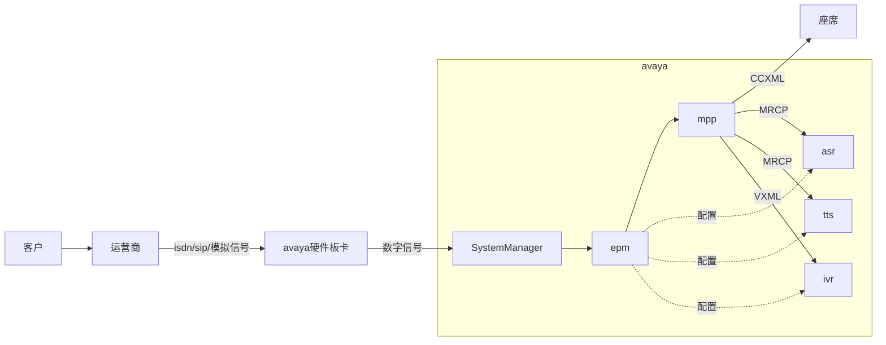

#avaya	#ivr	#uui	

## 一通会话的进线过程

1. 用户拨打电话
2. 电信运营商接入会话，根据被叫号将会话接入卡中心
3. 卡中心硬件板卡将模拟电路信号转换为数字信号
4. SystemManager
5. epm
6. mpp
7. asr
8. tts
9. ivr
10. 座席



aaod 开发过程的一些设想

- 多模块的开发，在 maven 运行前将非公共流程的代码，通过 shell 脚本合并到一起，然后将所有模块打包成一个应用。涉及到跨模块的流程调用，统一使用一个虚拟的公共流程做跳板，对流程的出口做预设处理。
- 挂机流程中注册回调流程。指定的流程中触发挂机事件需要跳转到回调流程中。


## 计算UUI

一般情况想，UUI根据非ASCII标准字符作为分隔符
例如:

`PD,00,FA,03E80E34619B2A50,C8,03E80E34619B2A50`

一般情况下
- FA表示当前callid
- C8表示自定义字段，一般是sip消息里的user-to-user
> 00C8143031303030313139303231363330333138363239FA0803E82E7E612CB025

00表示起始符号

```java
public void decode(String hex) {

    for (int i = 0; i < hex.length(); i = i + 2) {
        String tag = hex.substring(i, i + 2);

        int mark = Integer.valueOf(tag, 16);

        if (mark > 0X7F) {// 非标准ASCII

            int start = i + 2;
            int len = Integer.valueOf(hex.substring(start, start + 2), 16) * 2;

            i = start + len;

            if ((i + 2) < hex.length()) {
                String value = hex.substring(start + 2, i + 2);
                System.out.println(tag + " " + len + " " + value +" "+decodeHex(value) );
            }

        }
    }
}

private String decodeHex(String hex) {
    BigInteger big = new BigInteger(hex,16);
    return new String(big.toByteArray());
}
```


## IVR

在End节点中，增加返回参数`AAI`，向其中赋值参数，avaya平台会自动将其拼接到`C8`后面

## ccxml

```js
function parseJson(String json){
	return eval("("+json+")")
}
```

### redirect

指定AAI

AAI必须严格按照格式，必须为类型加16进制的表现形式
#hints

```xml
<var name="dialog_values" expr="parseJson('{}')"/>  
<assign name="dialog_values.AAI" expr="event$.connection.aai+'C8,03E80E34619B2A50'"/>  
<redirect connectionid="main_connectionid" dest="event$.uri" hints="dialog_values"/>
```

###  日志

一般在`/opt/Avaya/ExperienceProtal/MPP/logs/process/CXI`下，通过`tail -f CCXML-SessionSlot-*`追踪

也可能在`/opt/Avaya/ExperienceProtal/MPP/logs/records/2021/09/23`下