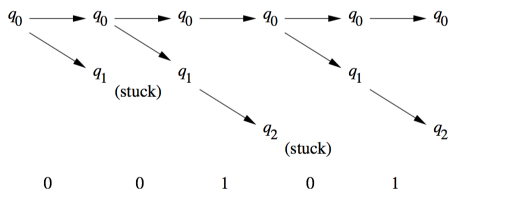
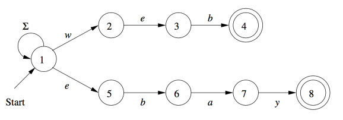
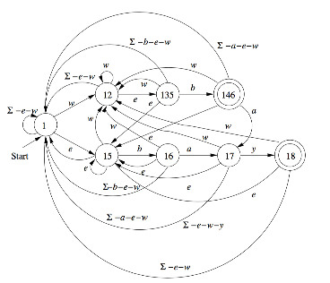
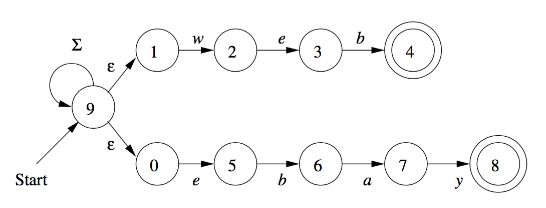
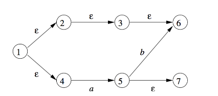

## 定义

- 非确定型有穷自动机（NFA），在某状态下，对于指定的输入，存在多个转移状态。一般情况下，通过某种算法可转换为 DFA

- 上下文无关文法 描述程序设计语言的结构以及相关集合的重要记号，用来构造编译器的语法分析部件。

- 字母表 符号的有穷非空集合。用$\Sigma$表示

- 串（有时候称为单词）是从某个字母表中选择的符号的有穷序列。例如 01101 是从二进制字母表$\Sigma = \lbrace 0,1\rbrace$中选出的串

- 空串 出现 0 次符号的串，记做$\varepsilon$

- 串的长度 这个串中的符号数，记做$\vert \omega \vert$，例如$\vert \varepsilon \vert = 0$

- 字母表的幂 定义$\Sigma^{k}$是长度为 k 的串的集合。串的每个符号都属于$\Sigma$。无论是什么字母表$\Sigma^{0}=\lbrace\varepsilon\rbrace$。字母表上所有的串的集合约定为$\Sigma^{*}$，排除空串的集合约定为$\Sigma^{+}$

- 串的连接 设定 x 和 y 都是串，于是 xy 表示 x 和 y 的连接

- 集合表示法 $\lbrace\omega\vert\omega$的语义描述$\rbrace$。比如$\lbrace\omega\vert\omega$包含相同个数的 0 或 1$\rbrace$，还可以把$\omega$换成某个带参数的表达式$\lbrace0^n1^n\vert n \ge1\rbrace$

- 当两个状态机交互时，当其状态处于$(i,x)$，对于一个合法的输入$Z$，可使$i \rightarrow j$，$x \rightarrow y$，那么我们可以认为$(i,x) \rightarrow (j,y)$是可达的

## 确定型有穷自动机（DFA）

确定型有穷自动机 包含若干个状态的集合，若干个输入符，当有输入时，控制权将由一个状态转移到另一个状态。在任意状态下，对于指定的输入，其转移是唯一的。

1. 一个有穷状态集合，记做$Q$，

2. 初始状态记做$q_0$,

3. 终止状态记做$F$

4. 一个有穷输入集合，记做$\Sigma$

5. 状态转移函数，记做$\delta$，以一个状态$q$和一个输入符号$a$作为参数，返回一个状态$p$。$\delta(q,a) = p;p\in Q$

6. 扩展状态转移函数，记做$\hat{\delta}$，以一个状态$q$和一个输入串$\omega$作为参数，返回一个状态$p$。
   - $\hat{\delta}(q,\varepsilon)=q$
   - 假定$\omega = xa$，a 是最后的输入，$\hat{\delta}(q,\omega)=\delta(\hat{\delta}(q,x),a)$

DFA 的定义:
$$A = (Q,\Sigma,\delta,q_0,F)$$

对于所有 DFA，我们可以定义为
$$L(A) = \lbrace \omega|\hat{\delta}(q_0,\omega)   \in F\rbrace$$

例如$\lbrace\omega|\omega$出现 01 字符串$\rbrace$可能出现三个状态

1. $q_0$ 未遇到 01，且最后一个不为 0，$\delta(q_0,0)=q_1,\delta(q_0,1)=q_0$
2. $q_1$ 未遇到 01，且最后一个为 0，$\delta(q_1,0)=q_1,\delta(q_0,1)=q_2$
3. $q_2$ 已遇到 01，可接受任意 0 或 1，$\delta(q_2,0)=q_2,\delta(q_2,1)=q_2$

其 DFA 表达式：
$$A = (\lbrace q_0,q_1,q_2\rbrace,\lbrace 0,1\rbrace,\delta,q_0,{q_2})$$

对 DFA 的细节描述难以阅读，通常使用两种方式来更好的描述

1. 状态转移图

   ```mermaid
   graph LR;
   begin( )-->|Start|q0
   q0-->|0|q1
   q0-->|1|q0
   q1-->|0|q1
   q1-->|1|q2
   q2-->|0,1|q2
   style begin color:white,fill:white,stroke:white
   ```

2. 状态转移表，一个状态和输入组成的$\delta$的表

   |                   | 0     | 1     |
   | ----------------: | :---- | :---- |
   | $\rightarrow q_0$ | $q_1$ | $q_0$ |
   |             $q_1$ | $q_1$ | $q_2$ |
   |             $q_2$ | $q_2$ | $q_2$ |

使用扩展转移函数，对一个串 0011 进行计算

1. $\hat{\delta}(q_0,\varepsilon)=q_0$

2. $\hat{\delta}(q_0,0)=\delta(\hat{\delta}(q_0,\varepsilon),0) =\delta(q_0,0) = q_1$

3. $\hat{\delta}(q_0,00)=\delta(\hat{\delta}(q_0,0),0) =\delta(q_1,0) = q_1$

4. $\hat{\delta}(q_0,001)=\delta(\hat{\delta}(q_0,00),1) =\delta(q_1,1) = q_2$

5. $\hat{\delta}(q_0,0011)=\delta(\hat{\delta}(q_0,001),1) =\delta(q_2,1) = q_2$

这种方式的处理，非常适合我们用递归函数进行计算。

## 非确定型有穷自动机（NFA）

与确定型有穷自动机类似，包含若干个状态，若干个输入符，状态转移函数，终止状态。唯一不同的是，$\delta$的结果可能是零个、一个、或多个状态的集合。

1. 一个有穷状态集合，记做$Q$，

2. 初始状态记做$q_0$,

3. 终止状态记做$F$

4. 一个有穷输入集合，记做$\Sigma$

5. 状态转移函数，记做$\delta$，以一个状态$q$和一个输入符号$a$作为参数，返回一个状态$p$。$\delta(q,a) = \lbrace p1,p2,\cdots,p_k \rbrace;\lbrace p1,p2,\cdots,p_k \rbrace\in Q$

6. 扩展状态转移函数，记做$\hat{\delta}$，以一个状态$q$和一个输入串$\omega$作为参数，返回一个状态$p$。
   - $\hat{\delta}(q,\varepsilon)=q$
   - 假定$\omega = xa$，$\hat{\delta}(q,x)=\lbrace p_1,p_2,\cdots,p_k \rbrace$，那么$\hat{\delta}(q,\omega)=\displaystyle\bigcup_{i=1}^k\delta(p_i,a)=\lbrace r_1,r_2,\cdots,r_m \rbrace$

对于 NFA，可以定义为
$$L(A) = \lbrace \omega|\hat{\delta}(q_0,\omega)   \cap F\rbrace \ne \emptyset$$

例如，$\lbrace \lbrace0,1\rbrace|$以 01 结尾$\rbrace$

其状态转移图如下

```mermaid
graph LR;
begin( )-->|Start|q0
q0-->|0|q1
q0-->|0,1|q0
q1-->|1|q2
style begin color:white,fill:white,stroke:white
```

当接受到 0 时，NFA 会猜测最后的 01 已经开始了，一条弧线从$q_0$指向$q_1$，我们可以看到 0 有两条弧线，另一条指向$q_0$。NFA 会同时走这两条线。当在$q_1$状态时，它会检查下一个符号是否为 1，如果是则会进入状态$q_2$。当在$q_2$状态时，如还有其他输入，这条路线就终结掉了。

00101 的处理过程如下


其状态转移表如下

|                   |                        0 |                    1 |
| ----------------: | -----------------------: | -------------------: |
| $\rightarrow q_0$ | $\lbrace q_0,q_1\rbrace$ | $\lbrace q_0\rbrace$ |
|             $q_1$ |              $\emptyset$ | $\lbrace q_2\rbrace$ |
|          \* $q_2$ |              $\emptyset$ |          $\emptyset$ |

使用扩展转移函数的处理过程如下

1. $\hat{\delta}(q_0,\varepsilon)=\lbrace q_0\rbrace$

2. $\hat{\delta}(q_0,0)=\delta(q_0,0) = \lbrace q_0,q_1\rbrace$

3. $\hat{\delta}(q_0,00)=\delta(q_0,0) \cup \delta(q_1,0)= \lbrace q_0\rbrace \cup \lbrace q_2\rbrace=\lbrace q_0,q_1\rbrace$

4. $\hat{\delta}(q_0,001)=\delta(q_0,1) \cup \delta(q_1,1)= \lbrace q_0\rbrace \cup \lbrace q_2\rbrace=\lbrace q_0,q_2\rbrace$

5. $\hat{\delta}(q_0,0010)=\delta(q_0,0) \cup \delta(q_2,0)= \lbrace q_0,q_1\rbrace \cup \emptyset=\lbrace q_0,q_1\rbrace$

6. $\hat{\delta}(q_0,00101)=\delta(q_0,1) \cup \delta(q_1,1)= \lbrace q_0\rbrace \cup \lbrace q_2\rbrace=\lbrace q_0,q_2\rbrace$

## NFA 与 DFA 的转换，子集构造

通常来说，构造 NFA 比构造 DFA 更容易，每一个用 NFA 描述的语言也能用 DFA 来描述。这个可以用`子集构造`来证明。

子集构造从一个 NFA $N = (Q_n,\Sigma,\delta_n,q_0,F_n)$开始，转换为
$D = (Q_d,\Sigma,\delta_d,\lbrace q_0 \rbrace,F_d)$

1. 两个自动机的输入字母表是相同的
2. D 的起始状态为仅包含 N 的起始状态的长度为 1 的集合
3. $Q_d$是$Q_n$子集的集合，即幂集合。假如$Q_n$有 n 个状态，那么$Q_d$有$2^n$状态，通常不是所有的状态都是从$q_0$可达的，这些状态可以丢弃，所以实际上$Q_d$的状态要远远小于$2^n$
4. $F_D$所有满足$S\cap F_n \neq \emptyset$的$Q_n$的子集的集合 S，也就是说，$F_D$是$Q_N$状态子集中至少包含一个$F_N$的集合。
5. 对于$S \subseteq Q_n$的集合 S 中每个状态来说，其对应的每个属于$\Sigma$的输入符号$a$的转移函数为：
   $$\delta_D(S,a)= \bigcup_{p \in S} \delta_N(p,a)$$

示例，我们以接受所有 01 结尾的串的 NFA 向 DFA 转换，由于$Q_n = \lbrace q_0,q_1,q_2\rbrace$，所以子集构造产生一个带有$2^3 = 8$(并非所有状态都是有意义的)种状态的 DFA

|                                  |                        0 |                        1 |
| -------------------------------: | -----------------------: | -----------------------: |
|                      $\emptyset$ |              $\emptyset$ |              $\emptyset$ |
| $\rightarrow \lbrace q_0\rbrace$ | $\lbrace q_0,q_1\rbrace$ |     $\lbrace q_0\rbrace$ |
|             $\lbrace q_1\rbrace$ |              $\emptyset$ |     $\lbrace q_2\rbrace$ |
|            $*\lbrace q_2\rbrace$ |              $\emptyset$ |              $\emptyset$ |
|         $\lbrace q_0,q_1\rbrace$ | $\lbrace q_0,q_1\rbrace$ | $\lbrace q_0,q_2\rbrace$ |
|        $*\lbrace q_0,q_2\rbrace$ | $\lbrace q_0,q_1\rbrace$ |     $\lbrace q_0\rbrace$ |
|        $*\lbrace q_1,q_2\rbrace$ |              $\emptyset$ |     $\lbrace q_2\rbrace$ |
|    $*\lbrace q_0,q_1,q_2\rbrace$ | $\lbrace q_0,q_1\rbrace$ | $\lbrace q_0,q_2\rbrace$ |

<empty></empty>
上述表格的详细证明如下（列举 2、5 两行）：
<empty></empty>

- $\delta_D(\lbrace q_0\rbrace,0) = \delta_N(q_0,0) = \lbrace q_0,q_1\rbrace$

- $\delta_D(\lbrace q_0\rbrace,1) = \delta_N(q_0,1) = \lbrace q_0\rbrace$

- $\delta_D(\lbrace q_0,q_1\rbrace,0) = \delta_N(q_0,0) \cup \delta_N(q_1,0)  = \lbrace q_0,q_1\rbrace \cup \emptyset = \lbrace q_0,q_1\rbrace$
- $\delta_D(\lbrace q_0,q_1\rbrace,1) = \delta_N(q_0,1) \cup \delta_N(q_1,1)  = \lbrace q_0\rbrace \cup \lbrace q_2\rbrace= \lbrace q_0,q_2\rbrace$

<empty></empty>
我们给这 8 中状态设计新的名字，如$A$表示$\emptyset$，$B$表示$\lbrace q_0 \rbrace$等。

|                 | 0   | 1   |
| --------------: | :-- | :-- |
|               A | A   | A   |
| $\rightarrow B$ | E   | B   |
|               C | A   | D   |
|            $*D$ | A   | A   |
|               E | E   | F   |
|            $*F$ | E   | B   |
|            $*G$ | A   | D   |
|            $*H$ | E   | F   |

从状态 B 开始，只能到达状态 B、E 和 F。其余五种状态都是从初始状态不可达的，也可以不出现在表中。如果向下面这样在子集合中执行`惰性求值`，通常就能避免以指数时间步骤为每个状态子集合构造转移表项目。一般情况下，我们可以从初始状态 A 开始计算可到达状态，若有新的可达状态，我们继续计算，直到没有新的可达状态。

```mermaid
graph LR;
begin( )-->|Start|B
B-->|0|E
B-->|1|B
E-->|0|E
E-->|1|F
F-->|0|E
F-->|1|B
style begin color:white,fill:white,stroke:white
```

我们需要证明这个子集构造是正确的。

在读入输入符号序列$\omega$后，所构造的 DFA 处于这样一个状态，这个状态时 NFA 在读$\omega$后所处的状态的集合。由于 DFA 的接受状态是至少包含一个 NFA 接受状态$F_n$的集合，因为包含 NFA 的可接受状态$F_n$，因此这个集合也是被 NFA 接受的。于是我们可以得出结论，这个 DFA 和 NFA 接受完全相同的语言。

我们来证明 若$D = (Q_d,\Sigma,\delta_d,\lbrace q_0 \rbrace,F_d)$是从$N = (Q_n,\Sigma,\delta_n,q_0,F_n)$子集构造出来的，那么$L(D) = L(N)$，这也就是证明，对于输入字母表$\omega$ ，$\hat{\delta}(\lbrace q_0\rbrace,\omega) = \hat{\delta}(q_0,\omega)$

1. 当$|\omega| =0$，即$\omega = \varepsilon$，根据$\hat{\delta}$的定义，$\hat{\delta}(\lbrace q_0\rbrace,\varepsilon)$ $\hat{\delta}(q_0,\varepsilon)$的结果都为$\lbrace q_0 \rbrace$

2. 假定$|\omega| = n + 1$ ，$\omega = xa$，$|x| = n$，$\hat{\delta}(\lbrace q_0\rbrace,x) = \hat{\delta}(q_0,x)$成立，两个集合状态 N 为$\lbrace p_1,p_2,\cdots,p_k\rbrace$。

那么对于 NFA：

$\hat{\delta}_N(q_0,\omega)=\displaystyle\bigcup_{i=1}^k\delta_N(p_i,a)$

通过子集构造的定义我们可以得出

$\delta_D(\lbrace p_1,p_2,\cdots,p_k\rbrace,a)=\displaystyle\bigcup_{i=1}^k\delta_N(p_i,a)$

又因
$\delta_D(\lbrace q_0\rbrace,x)= \lbrace p_1,p_2,\cdots,p_k\rbrace$

$\hat{\delta_D}(\lbrace q_0\rbrace,w) = \delta_D(\hat{\delta_D}(\lbrace q_0\rbrace,x),a) =\delta_D( \lbrace p_1,p_2,\cdots,p_k\rbrace,a)=\displaystyle\bigcup_{i=1}^k\delta_N(p_i,a)$

## 文本搜索

识别 web 和 ebay 出现

通过 NFA 来实现


对终止状态`[4,8]`增加了回到`1`的转移，以支持 web 和 ebay 出现在中间位置。

```javascript
//识别单词web和ebay出现的NFA

//状态转移函数
var delta = {
  1: (a) => {
    if (a == "w") return [1, 2];
    else if (a == "e") return [1, 5];
    else return [1];
  },
  2: (a) => (a === "e" ? [3] : []),
  3: (a) => (a === "b" ? [4] : []),
  4: (a) => [1, 4],
  5: (a) => (a === "b" ? [6] : []),
  6: (a) => (a === "a" ? [7] : []),
  7: (a) => (a === "y" ? [8] : []),
  8: (a) => [1, 8],
};

//所有状态
Qn = [1, 2, 3, 4, 5, 6, 7, 8];
//初始状态
q0 = 1;
//终止状态
F = [4, 8];

//扩展状态转移函数
function hat_delat(q0, w) {
  if (typeof w === "string") {
    w = w.split("");
  }
  //ε的总是返回当前状态
  if (w.length === 0) {
    return [q0];
  }
  let result = [];
  //ω=xa，将结果并集
  hat_delat(q0, w.slice(0, -1)).forEach((q) => {
    let a = w[w.length - 1];
    let next = delta[q](a);
    //去重合并
    next
      .filter((item) => !result.includes(item))
      .forEach((item) => result.push(item));
  });
  return result;
}

console.log(hat_delat(q0, "webay"));
console.log(hat_delat(q0, "aebay"));
console.log(hat_delat(q0, "abc"));
```

通过子集构造的方式来转换为 DFA，省略`[4,8]`的`1`出口


```javascript
//状态转移函数
let delta = {
  1: (a) => {
    if (a === "w") return [1, 2];
    else if (a === "e") return [1, 5];
    else return [1];
  },
  2: (a) => (a === "e" ? [3] : []),
  3: (a) => (a === "b" ? [4] : []),
  4: (a) => [],
  5: (a) => (a === "b" ? [6] : []),
  6: (a) => (a === "a" ? [7] : []),
  7: (a) => (a === "y" ? [8] : []),
  8: (a) => [],
};

//所有状态
Qn = [1, 2, 3, 4, 5, 6, 7, 8];
//初始状态
q0 = 1;
//终止状态
F = [4, 8];

//由NFA状态子集构造构成的DFA状态集合
DFA = {};

//输入字母表为26个字母
Sigma = "qwertyuiopasdfghjklzxcvbnm".split("");

//为Array添加equal方法，判断内部元素是否相同
Array.prototype.equal = function (other) {
  if (this.length === other.length) {
    let equal = true;
    for (let i = 0; i < other.length; i++) {
      if (this[i] !== other[i]) {
        equal = false;
        break;
      }
    }
    return equal;
  } else {
    return false;
  }
};
//为Array添加去重函数，若内部元素为数组，则根据内部数组元素是否完全相同来去重
Array.prototype.unique = function () {
  let temp = [];
  for (let i = 0; i < this.length; i++) {
    let insert = true;
    let item = this[i];
    if (Array.isArray(item)) {
      for (let j = 0; j < temp.length; j++) {
        if (temp[j].equal(item)) {
          insert = false;
        }
      }
    } else {
      insert = temp.indexOf(item) === -1;
    }
    if (insert) {
      temp.push(item);
    }
  }
  return temp;
};

//子集构造
function sub_construct(dfa_state_by_nfa) {
  if (dfa_state_by_nfa.length === 0) {
    return;
  }
  let trans = DFA[dfa_state_by_nfa];
  //已经计算过的子集不在计算
  if (trans === undefined) {
    trans = {};
    DFA[dfa_state_by_nfa] = trans;
    Sigma.forEach((input) => {
      //根据子集构造的定义，DFA子集构造的转移函数，对于特定输入，state_arr的所有状态的转移函数结构的集合

      let dfa_of_state_arr = [];
      dfa_state_by_nfa.forEach((state) => {
        dfa_of_state_arr = dfa_of_state_arr.concat(delta[state](input));
      });
      //DFA 状态转移函数，
      trans[input] = dfa_of_state_arr.sort().unique();
    });

    //检查是否触发了新的DFA状态，如果有，则继续向前查找
    Object.values(trans)
      .unique()
      .forEach((dfa_trans) => {
        sub_construct(dfa_trans);
      });
  }
}

sub_construct([q0]);
console.log(DFA);

//子集构造完成后，我们就可以根据DFA的定义来扩展转移函数
function hal_delta(states, w) {
  if (typeof w === "string") {
    w = w.split("");
  }
  if (w.length === 0) {
    return states;
  }
  return DFA[hal_delta(states, w.slice(0, -1))][w[w.length - 1]];
}

console.log(hal_delta([q0], "webay"));
```

上述输出结果为，与例图完美对应

```js
{
  '1': {
    q: [ 1 ],
    w: [ 1, 2 ],
    e: [ 1, 5 ],
    r: [ 1 ],
    t: [ 1 ],
    y: [ 1 ],
    u: [ 1 ],
    i: [ 1 ],
    o: [ 1 ],
    p: [ 1 ],
    a: [ 1 ],
    s: [ 1 ],
    d: [ 1 ],
    f: [ 1 ],
    g: [ 1 ],
    h: [ 1 ],
    j: [ 1 ],
    k: [ 1 ],
    l: [ 1 ],
    z: [ 1 ],
    x: [ 1 ],
    c: [ 1 ],
    v: [ 1 ],
    b: [ 1 ],
    n: [ 1 ],
    m: [ 1 ]
  },
  '1,2': {
    q: [ 1 ],
    w: [ 1, 2 ],
    e: [ 1, 3, 5 ],
    r: [ 1 ],
    t: [ 1 ],
    y: [ 1 ],
    u: [ 1 ],
    i: [ 1 ],
    o: [ 1 ],
    p: [ 1 ],
    a: [ 1 ],
    s: [ 1 ],
    d: [ 1 ],
    f: [ 1 ],
    g: [ 1 ],
    h: [ 1 ],
    j: [ 1 ],
    k: [ 1 ],
    l: [ 1 ],
    z: [ 1 ],
    x: [ 1 ],
    c: [ 1 ],
    v: [ 1 ],
    b: [ 1 ],
    n: [ 1 ],
    m: [ 1 ]
  },
  '1,3,5': {
    q: [ 1 ],
    w: [ 1, 2 ],
    e: [ 1, 5 ],
    r: [ 1 ],
    t: [ 1 ],
    y: [ 1 ],
    u: [ 1 ],
    i: [ 1 ],
    o: [ 1 ],
    p: [ 1 ],
    a: [ 1 ],
    s: [ 1 ],
    d: [ 1 ],
    f: [ 1 ],
    g: [ 1 ],
    h: [ 1 ],
    j: [ 1 ],
    k: [ 1 ],
    l: [ 1 ],
    z: [ 1 ],
    x: [ 1 ],
    c: [ 1 ],
    v: [ 1 ],
    b: [ 1, 4, 6 ],
    n: [ 1 ],
    m: [ 1 ]
  },
  '1,5': {
    q: [ 1 ],
    w: [ 1, 2 ],
    e: [ 1, 5 ],
    r: [ 1 ],
    t: [ 1 ],
    y: [ 1 ],
    u: [ 1 ],
    i: [ 1 ],
    o: [ 1 ],
    p: [ 1 ],
    a: [ 1 ],
    s: [ 1 ],
    d: [ 1 ],
    f: [ 1 ],
    g: [ 1 ],
    h: [ 1 ],
    j: [ 1 ],
    k: [ 1 ],
    l: [ 1 ],
    z: [ 1 ],
    x: [ 1 ],
    c: [ 1 ],
    v: [ 1 ],
    b: [ 1, 6 ],
    n: [ 1 ],
    m: [ 1 ]
  },
  '1,6': {
    q: [ 1 ],
    w: [ 1, 2 ],
    e: [ 1, 5 ],
    r: [ 1 ],
    t: [ 1 ],
    y: [ 1 ],
    u: [ 1 ],
    i: [ 1 ],
    o: [ 1 ],
    p: [ 1 ],
    a: [ 1, 7 ],
    s: [ 1 ],
    d: [ 1 ],
    f: [ 1 ],
    g: [ 1 ],
    h: [ 1 ],
    j: [ 1 ],
    k: [ 1 ],
    l: [ 1 ],
    z: [ 1 ],
    x: [ 1 ],
    c: [ 1 ],
    v: [ 1 ],
    b: [ 1 ],
    n: [ 1 ],
    m: [ 1 ]
  },
  '1,7': {
    q: [ 1 ],
    w: [ 1, 2 ],
    e: [ 1, 5 ],
    r: [ 1 ],
    t: [ 1 ],
    y: [ 1, 8 ],
    u: [ 1 ],
    i: [ 1 ],
    o: [ 1 ],
    p: [ 1 ],
    a: [ 1 ],
    s: [ 1 ],
    d: [ 1 ],
    f: [ 1 ],
    g: [ 1 ],
    h: [ 1 ],
    j: [ 1 ],
    k: [ 1 ],
    l: [ 1 ],
    z: [ 1 ],
    x: [ 1 ],
    c: [ 1 ],
    v: [ 1 ],
    b: [ 1 ],
    n: [ 1 ],
    m: [ 1 ]
  },
  '1,8': {
    q: [ 1 ],
    w: [ 1, 2 ],
    e: [ 1, 5 ],
    r: [ 1 ],
    t: [ 1 ],
    y: [ 1 ],
    u: [ 1 ],
    i: [ 1 ],
    o: [ 1 ],
    p: [ 1 ],
    a: [ 1 ],
    s: [ 1 ],
    d: [ 1 ],
    f: [ 1 ],
    g: [ 1 ],
    h: [ 1 ],
    j: [ 1 ],
    k: [ 1 ],
    l: [ 1 ],
    z: [ 1 ],
    x: [ 1 ],
    c: [ 1 ],
    v: [ 1 ],
    b: [ 1 ],
    n: [ 1 ],
    m: [ 1 ]
  },
  '1,4,6': {
    q: [ 1 ],
    w: [ 1, 2 ],
    e: [ 1, 5 ],
    r: [ 1 ],
    t: [ 1 ],
    y: [ 1 ],
    u: [ 1 ],
    i: [ 1 ],
    o: [ 1 ],
    p: [ 1 ],
    a: [ 1, 7 ],
    s: [ 1 ],
    d: [ 1 ],
    f: [ 1 ],
    g: [ 1 ],
    h: [ 1 ],
    j: [ 1 ],
    k: [ 1 ],
    l: [ 1 ],
    z: [ 1 ],
    x: [ 1 ],
    c: [ 1 ],
    v: [ 1 ],
    b: [ 1 ],
    n: [ 1 ],
    m: [ 1 ]
  }
}
//扩展转移函数的输出
[ 1, 8 ]
```

## $\varepsilon$转移

有穷自动机的另一种扩展，允许在空串$\varepsilon$上进行转移，即 NFA 在没有接受到输入符号就自动转移。

例如识别 web 和 ebay 的$\varepsilon$转移


$\varepsilon\text{-}NFA$的正式定义

$\varepsilon\text{-}NFA$的定义与 NFA 基本一致，除了$\delta$函数必须含有在$\varepsilon$上转移的信息。

$$A = (Q,\Sigma,\delta,q_0,F)$$

其中$\delta$的参数

1. $Q$中的一个状态
2. $\Sigma\cup\varepsilon$中的一个元素，也就是说要么是输入符号，要么是$\varepsilon$，且要求$\varepsilon$不是$\Sigma$的元素

<empty></empty>
$\varepsilon$闭包

顺着从状态 q 出发带$\varepsilon$标记的转移来求 q 的$\varepsilon$闭包

1. 状态 $q$ 属于$ECLOSED(q)$
2. 如果 $p$ 属于$ECLOSED(q)$，并且有从状态 $p$到状态$r$带$\varepsilon$转移，则 r 属于$ECLOSED(q)$
3. 有时候我们需要对状态$S$的集合计算$\varepsilon$闭包，办法是取每个状态的$\varepsilon$闭包的并集，即$ECLOSED(S) = \displaystyle\bigcup_{q \in S} ECLOSED(q)$

例如

$ECLOSE(1) = \lbrace 1,2,3,4,6\rbrace$


$\varepsilon\text{-}NFA$扩展转移函数

1. $\hat{\delta}(q,\varepsilon) = ECLOSE(q)$
2. 假设$w=xa,a \in \Sigma,a \ne \varepsilon,\hat{\delta}(q,x) = \lbrace p_1,p_2,\cdots,p_k\rbrace$
3. 根据 NFA 的定义，我们可设$\displaystyle\bigcup_{i=1}^k\delta(p_i,a)$为$\lbrace r_1,r_2,\cdots,r_m\rbrace$
4. 那么$\hat{\delta}(q,\omega)=\displaystyle\bigcup_{j=1}^mECLOSE(r_j)$

## $\varepsilon$转移的子集构造

对于给定的$\varepsilon\text{-}NFA$的集合$E$，我们可以求出一个与$E$接受相同语言的$DFA$集合$D$，设$E = (Q_E,\Sigma,\delta_E,\lbrace q_0 \rbrace,F_E)$，
则等价的 DFA 为
$$D = (Q_D,\Sigma,\delta_D,q_D ,F_D)$$

1. $Q_D$是$Q_E$的子集的集合
2. $q_D= ECLOSE(q_0)$
3. $F_D$所有满足$S\cap F_E \neq \emptyset$的$Q_E$的子集的集合 S，也就是说，$F_D$是$Q_E$状态子集中至少包含一个$F_E$的集合。
4. 对于所有属于$\Sigma$的 a 和属于$Q_D$的集合$S$，计算$\delta_D(S,a)$的方法如下：
   1. 设$S=\lbrace p_1,p_2,\cdots,p_k\rbrace$
   2. 设$\displaystyle\bigcup_{i=1}^k\delta(p_i,a)$为$\lbrace r_1,r_2,\cdots,r_m\rbrace$
   3. 则$\delta_D(S,a)=\displaystyle\bigcup_{j=1}^mECLOSE(r_j)$

示例，通过识别单词 web 和 ebay 出现的$\varepsilon\text{-}NFA$

```javascript
function noepsilon(input, next, compared_value) {
  if (input.length > 0 && input === compared_value) {
    return next;
  }
  return [];
}

//状态转移函数
let delta = {
  0: (a) => noepsilon(a, [5], "e"),
  1: (a) => noepsilon(a, [2], "w"),
  2: (a) => noepsilon(a, [3], "e"),
  3: (a) => noepsilon(a, [4], "b"),
  4: (a) => [],
  5: (a) => noepsilon(a, [6], "b"),
  6: (a) => noepsilon(a, [7], "a"),
  7: (a) => noepsilon(a, [8], "y"),
  8: (a) => [],
  9: (a) => {
    if (a.length === 0) {
      return [0, 1];
    } else {
      return [9];
    }
  },
};

//所有状态
Qn = [0, 1, 2, 3, 4, 5, 6, 7, 8, 9];
//初始状态
q0 = 9;
//终止状态
F = [4, 8];

//由NFA状态子集构成的DFA状态集合
DFA = {};

//输入字母表为26个字母
Sigma = "qwertyuiopasdfghjklzxcvbnm".split("");

//为Array添加equal方法，判断内部元素是否相同
Array.prototype.equal = function (other) {
  if (this.length === other.length) {
    let equal = true;
    for (let i = 0; i < other.length; i++) {
      if (this[i] !== other[i]) {
        equal = false;
        break;
      }
    }
    return equal;
  } else {
    return false;
  }
};
//为Array添加去重函数，若内部元素为数组，则根据内部数组元素是否完全相同来去重
Array.prototype.unique = function () {
  let temp = [];
  for (let i = 0; i < this.length; i++) {
    let insert = true;
    var item = this[i];
    if (Array.isArray(item)) {
      for (let j = 0; j < temp.length; j++) {
        if (temp[j].equal(item)) {
          insert = false;
        }
      }
    } else {
      insert = temp.indexOf(item) === -1;
    }
    if (insert) {
      temp.push(item);
    }
  }
  return temp;
};

//集合S的eclose闭包
function eclose_of_set(states) {
  let transitions = [];
  states.forEach((state) => {
    //求epsilon转移状态
    delta[state]("").forEach((transition) => {
      transitions.push(transition);
    });
  });
  //如果存在epsilon转移状态，则继续向前查找
  if (transitions.length > 0) {
    transitions = transitions.concat(eclose_of_set(transitions));
  }
  //根据闭包的定义，集合S也属于闭包
  return transitions.concat(states).sort().unique();
}

//ε-NFA的扩展转移函数
function nfa_hal_delta(states, w) {
  if (typeof w === "string") {
    w = w.split("");
  }

  let transitions = [];
  if (w.length === 0) {
    transitions = states;
  } else {
    //  ω=xa，将结果并集
    nfa_hal_delta(states, w.slice(0, -1)).forEach((state) => {
      let lastInput = w[w.length - 1];
      let nextTransitions = delta[state](lastInput);
      //去重合并
      nextTransitions.forEach((state) => transitions.push(state));
    });
  }
  transitions = transitions.sort().unique();
  transitions = eclose_of_set(transitions);
  console.log(w, transitions);
  return transitions;
}

nfa_hal_delta([q0], "webay");

//ε子集构造
function sub_construct(states) {
  if (states.length === 0) {
    return;
  }
  let transitions = DFA[states];
  //已经计算过的子集不在计算
  if (transitions === undefined) {
    transitions = {};
    DFA[states] = transitions;
    Sigma.forEach((input) => {
      //根据子集构造的定义，DFA子集构造的转移函数，对于特定输入，state_arr的所有状态的转移函数结构的集合

      let dfa_of_state_arr = [];
      states.forEach((state) => {
        dfa_of_state_arr = dfa_of_state_arr.concat(delta[state](input));
      });
      //计算出子集构造后的e闭包
      dfa_of_state_arr = eclose_of_set(dfa_of_state_arr.sort().unique());
      transitions[input] = dfa_of_state_arr;
    });

    //检查是否触发了新的DFA状态，如果有，则继续向前查找
    Object.values(transitions)
      .unique()
      .forEach((dfa_of_state_arr) => {
        sub_construct(dfa_of_state_arr);
      });
  }
}

sub_construct([q0]);
console.log(DFA);

//ε子集构造完成后，我们就可以根据DFA的定义来扩展转移函数
function hal_delta(states, w) {
  if (typeof w === "string") {
    w = w.split("");
  }
  let transitions;
  if (w.length === 0) {
    transitions = eclose_of_set(states);
  } else {
    transitions = DFA[hal_delta(states, w.slice(0, -1))][w[w.length - 1]];
  }
  console.log(w, transitions);
  return transitions;
}

console.log(hal_delta([q0], "webay"));
```

输出结果

```json
[] [ 0, 1, 9 ]
[ 'w' ] [ 0, 1, 2, 9 ]
[ 'w', 'e' ] [ 0, 1, 3, 5, 9 ]
[ 'w', 'e', 'b' ] [ 0, 1, 4, 6, 9 ]
[ 'w', 'e', 'b', 'a' ] [ 0, 1, 7, 9 ]
[ 'w', 'e', 'b', 'a', 'y' ] [ 0, 1, 8, 9 ]
{
  '9': {
    q: [ 0, 1, 9 ],
    w: [ 0, 1, 9 ],
    e: [ 0, 1, 9 ],
    r: [ 0, 1, 9 ],
    t: [ 0, 1, 9 ],
    y: [ 0, 1, 9 ],
    u: [ 0, 1, 9 ],
    i: [ 0, 1, 9 ],
    o: [ 0, 1, 9 ],
    p: [ 0, 1, 9 ],
    a: [ 0, 1, 9 ],
    s: [ 0, 1, 9 ],
    d: [ 0, 1, 9 ],
    f: [ 0, 1, 9 ],
    g: [ 0, 1, 9 ],
    h: [ 0, 1, 9 ],
    j: [ 0, 1, 9 ],
    k: [ 0, 1, 9 ],
    l: [ 0, 1, 9 ],
    z: [ 0, 1, 9 ],
    x: [ 0, 1, 9 ],
    c: [ 0, 1, 9 ],
    v: [ 0, 1, 9 ],
    b: [ 0, 1, 9 ],
    n: [ 0, 1, 9 ],
    m: [ 0, 1, 9 ]
  },
  '0,1,9': {
    q: [ 0, 1, 9 ],
    w: [ 0, 1, 2, 9 ],
    e: [ 0, 1, 5, 9 ],
    r: [ 0, 1, 9 ],
    t: [ 0, 1, 9 ],
    y: [ 0, 1, 9 ],
    u: [ 0, 1, 9 ],
    i: [ 0, 1, 9 ],
    o: [ 0, 1, 9 ],
    p: [ 0, 1, 9 ],
    a: [ 0, 1, 9 ],
    s: [ 0, 1, 9 ],
    d: [ 0, 1, 9 ],
    f: [ 0, 1, 9 ],
    g: [ 0, 1, 9 ],
    h: [ 0, 1, 9 ],
    j: [ 0, 1, 9 ],
    k: [ 0, 1, 9 ],
    l: [ 0, 1, 9 ],
    z: [ 0, 1, 9 ],
    x: [ 0, 1, 9 ],
    c: [ 0, 1, 9 ],
    v: [ 0, 1, 9 ],
    b: [ 0, 1, 9 ],
    n: [ 0, 1, 9 ],
    m: [ 0, 1, 9 ]
  },
  '0,1,2,9': {
    q: [ 0, 1, 9 ],
    w: [ 0, 1, 2, 9 ],
    e: [ 0, 1, 3, 5, 9 ],
    r: [ 0, 1, 9 ],
    t: [ 0, 1, 9 ],
    y: [ 0, 1, 9 ],
    u: [ 0, 1, 9 ],
    i: [ 0, 1, 9 ],
    o: [ 0, 1, 9 ],
    p: [ 0, 1, 9 ],
    a: [ 0, 1, 9 ],
    s: [ 0, 1, 9 ],
    d: [ 0, 1, 9 ],
    f: [ 0, 1, 9 ],
    g: [ 0, 1, 9 ],
    h: [ 0, 1, 9 ],
    j: [ 0, 1, 9 ],
    k: [ 0, 1, 9 ],
    l: [ 0, 1, 9 ],
    z: [ 0, 1, 9 ],
    x: [ 0, 1, 9 ],
    c: [ 0, 1, 9 ],
    v: [ 0, 1, 9 ],
    b: [ 0, 1, 9 ],
    n: [ 0, 1, 9 ],
    m: [ 0, 1, 9 ]
  },
  '0,1,3,5,9': {
    q: [ 0, 1, 9 ],
    w: [ 0, 1, 2, 9 ],
    e: [ 0, 1, 5, 9 ],
    r: [ 0, 1, 9 ],
    t: [ 0, 1, 9 ],
    y: [ 0, 1, 9 ],
    u: [ 0, 1, 9 ],
    i: [ 0, 1, 9 ],
    o: [ 0, 1, 9 ],
    p: [ 0, 1, 9 ],
    a: [ 0, 1, 9 ],
    s: [ 0, 1, 9 ],
    d: [ 0, 1, 9 ],
    f: [ 0, 1, 9 ],
    g: [ 0, 1, 9 ],
    h: [ 0, 1, 9 ],
    j: [ 0, 1, 9 ],
    k: [ 0, 1, 9 ],
    l: [ 0, 1, 9 ],
    z: [ 0, 1, 9 ],
    x: [ 0, 1, 9 ],
    c: [ 0, 1, 9 ],
    v: [ 0, 1, 9 ],
    b: [ 0, 1, 4, 6, 9 ],
    n: [ 0, 1, 9 ],
    m: [ 0, 1, 9 ]
  },
  '0,1,5,9': {
    q: [ 0, 1, 9 ],
    w: [ 0, 1, 2, 9 ],
    e: [ 0, 1, 5, 9 ],
    r: [ 0, 1, 9 ],
    t: [ 0, 1, 9 ],
    y: [ 0, 1, 9 ],
    u: [ 0, 1, 9 ],
    i: [ 0, 1, 9 ],
    o: [ 0, 1, 9 ],
    p: [ 0, 1, 9 ],
    a: [ 0, 1, 9 ],
    s: [ 0, 1, 9 ],
    d: [ 0, 1, 9 ],
    f: [ 0, 1, 9 ],
    g: [ 0, 1, 9 ],
    h: [ 0, 1, 9 ],
    j: [ 0, 1, 9 ],
    k: [ 0, 1, 9 ],
    l: [ 0, 1, 9 ],
    z: [ 0, 1, 9 ],
    x: [ 0, 1, 9 ],
    c: [ 0, 1, 9 ],
    v: [ 0, 1, 9 ],
    b: [ 0, 1, 6, 9 ],
    n: [ 0, 1, 9 ],
    m: [ 0, 1, 9 ]
  },
  '0,1,6,9': {
    q: [ 0, 1, 9 ],
    w: [ 0, 1, 2, 9 ],
    e: [ 0, 1, 5, 9 ],
    r: [ 0, 1, 9 ],
    t: [ 0, 1, 9 ],
    y: [ 0, 1, 9 ],
    u: [ 0, 1, 9 ],
    i: [ 0, 1, 9 ],
    o: [ 0, 1, 9 ],
    p: [ 0, 1, 9 ],
    a: [ 0, 1, 7, 9 ],
    s: [ 0, 1, 9 ],
    d: [ 0, 1, 9 ],
    f: [ 0, 1, 9 ],
    g: [ 0, 1, 9 ],
    h: [ 0, 1, 9 ],
    j: [ 0, 1, 9 ],
    k: [ 0, 1, 9 ],
    l: [ 0, 1, 9 ],
    z: [ 0, 1, 9 ],
    x: [ 0, 1, 9 ],
    c: [ 0, 1, 9 ],
    v: [ 0, 1, 9 ],
    b: [ 0, 1, 9 ],
    n: [ 0, 1, 9 ],
    m: [ 0, 1, 9 ]
  },
  '0,1,7,9': {
    q: [ 0, 1, 9 ],
    w: [ 0, 1, 2, 9 ],
    e: [ 0, 1, 5, 9 ],
    r: [ 0, 1, 9 ],
    t: [ 0, 1, 9 ],
    y: [ 0, 1, 8, 9 ],
    u: [ 0, 1, 9 ],
    i: [ 0, 1, 9 ],
    o: [ 0, 1, 9 ],
    p: [ 0, 1, 9 ],
    a: [ 0, 1, 9 ],
    s: [ 0, 1, 9 ],
    d: [ 0, 1, 9 ],
    f: [ 0, 1, 9 ],
    g: [ 0, 1, 9 ],
    h: [ 0, 1, 9 ],
    j: [ 0, 1, 9 ],
    k: [ 0, 1, 9 ],
    l: [ 0, 1, 9 ],
    z: [ 0, 1, 9 ],
    x: [ 0, 1, 9 ],
    c: [ 0, 1, 9 ],
    v: [ 0, 1, 9 ],
    b: [ 0, 1, 9 ],
    n: [ 0, 1, 9 ],
    m: [ 0, 1, 9 ]
  },
  '0,1,8,9': {
    q: [ 0, 1, 9 ],
    w: [ 0, 1, 2, 9 ],
    e: [ 0, 1, 5, 9 ],
    r: [ 0, 1, 9 ],
    t: [ 0, 1, 9 ],
    y: [ 0, 1, 9 ],
    u: [ 0, 1, 9 ],
    i: [ 0, 1, 9 ],
    o: [ 0, 1, 9 ],
    p: [ 0, 1, 9 ],
    a: [ 0, 1, 9 ],
    s: [ 0, 1, 9 ],
    d: [ 0, 1, 9 ],
    f: [ 0, 1, 9 ],
    g: [ 0, 1, 9 ],
    h: [ 0, 1, 9 ],
    j: [ 0, 1, 9 ],
    k: [ 0, 1, 9 ],
    l: [ 0, 1, 9 ],
    z: [ 0, 1, 9 ],
    x: [ 0, 1, 9 ],
    c: [ 0, 1, 9 ],
    v: [ 0, 1, 9 ],
    b: [ 0, 1, 9 ],
    n: [ 0, 1, 9 ],
    m: [ 0, 1, 9 ]
  },
  '0,1,4,6,9': {
    q: [ 0, 1, 9 ],
    w: [ 0, 1, 2, 9 ],
    e: [ 0, 1, 5, 9 ],
    r: [ 0, 1, 9 ],
    t: [ 0, 1, 9 ],
    y: [ 0, 1, 9 ],
    u: [ 0, 1, 9 ],
    i: [ 0, 1, 9 ],
    o: [ 0, 1, 9 ],
    p: [ 0, 1, 9 ],
    a: [ 0, 1, 7, 9 ],
    s: [ 0, 1, 9 ],
    d: [ 0, 1, 9 ],
    f: [ 0, 1, 9 ],
    g: [ 0, 1, 9 ],
    h: [ 0, 1, 9 ],
    j: [ 0, 1, 9 ],
    k: [ 0, 1, 9 ],
    l: [ 0, 1, 9 ],
    z: [ 0, 1, 9 ],
    x: [ 0, 1, 9 ],
    c: [ 0, 1, 9 ],
    v: [ 0, 1, 9 ],
    b: [ 0, 1, 9 ],
    n: [ 0, 1, 9 ],
    m: [ 0, 1, 9 ]
  }
}
[] [ 0, 1, 9 ]
[ 'w' ] [ 0, 1, 2, 9 ]
[ 'w', 'e' ] [ 0, 1, 3, 5, 9 ]
[ 'w', 'e', 'b' ] [ 0, 1, 4, 6, 9 ]
[ 'w', 'e', 'b', 'a' ] [ 0, 1, 7, 9 ]
[ 'w', 'e', 'b', 'a', 'y' ] [ 0, 1, 8, 9 ]
[ 0, 1, 8, 9 ]

```
