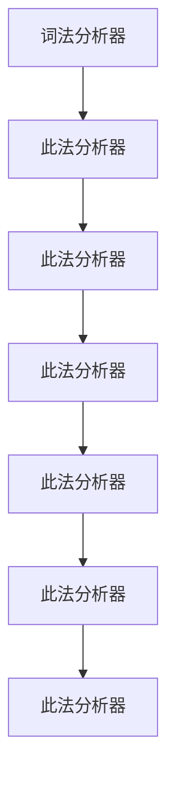

[编译原理（哈工大）_哔哩哔哩](https://www.bilibili.com/video/BV1zW411t7YE?from=search&seid=17662228773593089278)
[[编译原理课件.pdf]]

## 编译器的结构

```mermaid
graph TD
    D1[词法分析器] -->
    D2[此法分析器] -->
    D3[此法分析器] -->
    D4[此法分析器] -->
    D5[此法分析器] -->
    D6[此法分析器] -->
    D7[此法分析器] 

```