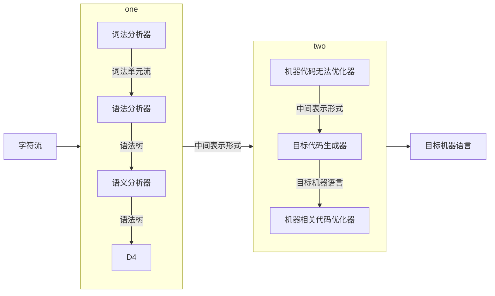

[编译原理（哈工大）_哔哩哔哩](https://www.bilibili.com/video/BV1zW411t7YE?from=search&seid=17662228773593089278)
[[编译原理课件.pdf]]


## 编译器的结构




```mermaid
stateDiagram-v2
	direction LR
    FE:分析部分
    BE: 综合部分
	D5:机器代码无关优化器
	
    state FE{
	
		D1:词法分析器
		D2:语法分析器
		D3:语义分析器
		D4:中间代码生成器
		
		D1 --> D2:词法单元流
		D2 --> D3:语法树
		D3 --> D4:语法树
	}
	state BE{
	
		D6:目标代码生成器
		D7:机器相关代码优化器
		D8:目标机器语言
		
		D6 --> D7:语法树
		D7 --> D8:语法树
	}
	
    [*] --> FE:字符流 
	FE --> D5
	D5 --> BE
    BE -->[*]:目标机器语言
