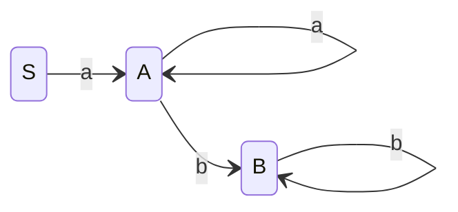
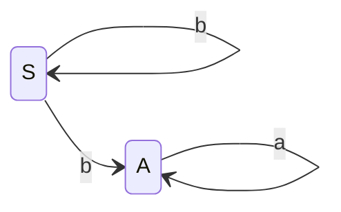

---
tags:
- katex
---
## 名词解释

### 集合表示法
$\lbrace\omega\vert\omega$的语义描述$\rbrace$。比如$\lbrace\omega\vert\omega$包含相同个数的 0 或 1$\rbrace$，还可以把 $\omega$ 换成某个带参数的表达式$\lbrace0^n1^n\vert n \ge1\rbrace$


## 字母表

符号的有穷非空集合。用    $\Sigma$ 表示
例如：
- 二进制字母表： $\lbrace 0,1 \rbrace$
- ASCII字母表

### 字母表的乘积（product）
$\Sigma_1\Sigma_2 =\lbrace a,b\vert a \in \Sigma_1,b \in \Sigma_2\rbrace$

例如：
$\lbrace 0，1\rbrace \lbrace a,b\rbrace = \lbrace0a,0b,1a,1b\rbrace$

### 字母表的n次幂（power）
长度为n的符号串构成的集合

$$
\begin{cases}
\Sigma^0 = \lbrace\varepsilon\rbrace\\
\Sigma = \Sigma^{n-1}\Sigma,n \ge 1
\end{cases}
$$

例：
$
\begin{equation}
\begin{split}   \lbrace0,1\rbrace^3 &= \lbrace0,1\rbrace \lbrace0,1\rbrace \lbrace0,1\rbrace\\
      &= \lbrace 000,001,010,011,100,101,110,111 \rbrace
\end{split}
\end{equation}
$


### 字母表的正闭包（positive closure）
长度为正数的符号串的集合
$
\Sigma^+ = \Sigma^1  \cup \Sigma^2 \cup \Sigma^3 \cup  \cdots
$
### 字母表的克林闭包
任意长度的符号串的集合
$
\Sigma^* = \Sigma^0 \cup \Sigma^1  \cup \Sigma^2 \cup \Sigma^3 \cup  \cdots
$

^075dd8

### 串（string，有时候称为单词）
串是[[#字母表]]中符号的一个有穷序列。
若 $\forall_x \in \Sigma^*$，则$x$称为$\Sigma$上的一个串
例如:
01101 是从二进制字母表$\Sigma = \lbrace 0,1\rbrace$中选出的串


### 串的长度
这个串中的符号数，记做$\vert \omega \vert$，
例如:
$$
\vert \varepsilon \vert = 0
$$

### 空串 
出现 0 次符号的串，记做 $\varepsilon$

### 串的连接（concatenation）
设定 $x$ 和 $y$ 都是串，于是 $xy$ 表示 $x$ 和 $y$ 的连接，表示把$y$ 附加到$x$后面而形成的串

例如：如果$x = dog , y = house$，那么$xy = doghouse$

空串是连接运算的单位元（identity），即对于任意串$s$都有
$$
\varepsilon s = s \varepsilon= s
$$


设 $x,y,z$ 是三个字符串，如果 $x=yz$则称$y$是$x$的`前缀`，$z$是$x$的`后缀`


### 串的幂运算
将n个s连接起来

$
\begin{cases}
s^0 = \varepsilon\\
s^n = s^{n-1},n \ge 1
\end{cases}
$

例：
如果$s=ba$，那么$s^0 = \varepsilon$，$s^1 = ab$，$s^2 = abab$，$\cdots$

## 文法

> 我们以整数加法运算来做例子
### 终结符（terminal symbol）
文法所定义的语言的基本符号，有时也称为token

例如：
$
\begin{cases}
	id = \lbrace 0,1,2,3,4,5,6,7,8,9 \rbrace^+
	 \\
	V_T = 	\lbrace +,id \rbrace
\end{cases}
$

### 非终结符（nonterminal）
用来表示语法成分的符号，有时也被称为语法变量，他是一个抽象概念
例如：

$
V_T = \lbrace E \rbrace  \text{：E是expr，表示表达式}
$

### 文法符号集

[[#终结符（terminal symbol）|终结符]]和[[#非终结符（nonterminal）|非终结符]]的并集，$V_T \cup V_N$

```ad-info
title:
[[#终结符（terminal symbol）|终结符]]和[[#非终结符（nonterminal）|非终结符]]结合是互斥的，$V_T \cap V_N = \emptyset$
```


### 产生式（production）

描述了将[[#终结符（terminal symbol）|终结符]]和[[#非终结符（nonterminal）|非终结符]]组成串的方法
一般表示为：

$$
\begin{cases}
\alpha \in \lbrace (V_T)^+ \cup V_N\rbrace^+ \\
\beta\in \lbrace V_T \cup V_N\rbrace^*\\

\alpha \to \beta
\end{cases}
$$ 
- $\alpha$ ：产生式的头部或左部
- $\beta$：产生式的体或右部

读作：$\alpha$ 定义为 $\beta$

例如：

$$
P = \begin{cases}
E \to id\\
E \to  E + E
\end{cases}
$$

对于一组具有相同左部的产生式可以简写为

$$
\alpha \to \beta_1\mid \beta_2 \mid \cdots \mid \beta_n
$$
$\beta_1\mid \beta_2 \mid \cdots \mid \beta_n$被称为$\alpha$的候选式（candidate）

例如：
$$
E \to id \mid E + E
$$

### 开始符号（start symbol）
表示该文法的最大的语法成分， $S \in V_N$


### 文法的形式化定义
$
G =  (V_T,V_N,P,S)
$

|      |             |
| ----- | ------------ |
| $V_T$ | 终结符集合   |
| $V_N$ | 非终结符集合 |
| $P$   | 产生式集合   |
| $S$   | 开始符号     | 


### 符号约定


```ad-summary
title:终结符
1. 排在前面的小写字母 `a` `b` `c`
2.	运算符
3.	标点符号
4.	数字
5.	粗体字符串，如 **id** **if**

```

```ad-summary
title:非终结符
1. 排在前面的大写字母 `A`  `B` `C`
2. 字母S通常表示开始符号
3. 小写斜体的名字，如 _expr_ _stmt_
4. 代表函数的大写字母，如E(表达式)，T(项)，F(因子)

```

```ad-summary
title:文法符号
排在后面的大写字母，如`X` `Y` `Z`
```

```ad-summary
title:终结符号串
排在后面的小写字母，如`u` `v` `...` `z`，包括空串
```
```ad-summary
title:文法符号串
小写希腊字母，如 $\alpha$ $\beta$ $\gamma$，包括空串
```

```ad-warning
title:
除非特殊说明，第一个产生式的左部就是[[#开始符号（start symbol）|开始符号]]
```


### 推导（Derivations） 
对于给定文法 $G =  (V_T,V_N,P,S)$ ,如果$\alpha \to \beta \in P$，
那么可将符号串 $\gamma \alpha \delta$ 重写为 $\gamma \beta\delta$ ，记作$\gamma \alpha \delta \Rightarrow \gamma \beta\delta$ ，
此时称文法中的符号串 $\gamma \alpha \delta$ 直接推导（directly derive）出 $\gamma \beta\delta$ ，
简而言之，就是 _用产生式的右部替换产生式的左部_

如果
$\alpha_0 \Rightarrow \alpha_1,\alpha_1 \Rightarrow \alpha_2, \cdots,\alpha_{n-1} \Rightarrow \alpha_{n}$
可记作
$\alpha_0 \Rightarrow \alpha_1 \Rightarrow \cdots \Rightarrow\alpha_{n-1} \Rightarrow \alpha_{n}$
简记
$\alpha \Rightarrow^n\alpha_n$

- $\alpha \Rightarrow^0\alpha$
- $\alpha \Rightarrow^+ \alpha_n$ 经过正数步推导
- $\alpha \Rightarrow^*\alpha_n$ 经过若干步推导
### 归约（Reductions）
规约就是推导的反向

### 文法的应用

判断某一词串是否是该语言的句子

- 从生成语言的角度来看，使用句子的推导
- 从识别语言的角度来看，使用句子的规约

### 句型和句子

#### **句型**
 如果$S \Rightarrow^* \alpha ,\alpha \in (V_T \cup V_N)^*$ ，则称$\alpha$是$G$的一个句型（sentential form），一个句型即可以包含[[#终结符（terminal symbol）|终结符]]，也可以包含[[#非终结符（nonterminal）|非终结符]]，也可以是[[#空串]]
#### **句子**
如果$S \Rightarrow^*\omega,\omega \in V_T^*$，则称$\omega$为$G$的一个句子（sentence），句子就是不包含[[#非终结符（nonterminal）|非终结符]]的句型

![[Pasted image 20211007170523.png]]

### 语言的形式化定义
由文法$G$的开始符号$S$推导出的所有句子构成的集合称为文法$G$生成的语言，记作$L(G)$ 。
即
$$
L(G) = \lbrace \omega \mid S \Rightarrow^*,\omega \in V_T^* \rbrace
$$

例如：

一个变量名的文法
1. $S \to L\mid LT$
1. $T \to L\mid D\mid TL\mid TD$
1. $SL\to a\mid b\mid c\mid\cdots\mid z$
1. $SD\to 0\mid 1\mid2\mid\cdots\mid9$

也可以直接表示为：
$$
L(L\cup D)^*
$$

### 上下文无关文法
上下文无关文法（Context-Free grammar，CFG）： 
$\forall\alpha \to \beta  \in P, \alpha \in V_N$
一般形式$A \to \beta$

### 上下文无关文法分析树

![[Pasted image 20211007225402.png|300]]

- 根节点是文法的[[#开始符号（start symbol）| 开始符号]]
- 内部节点表示对一个[[#产生式（production）|产生式]] $A\to\beta$ 的应用，该节点的标号是此[[#产生式（production）|产生式]]的左部 $A$ ，该节点的子节点的标号从左到右构成了[[#产生式（production）|产生式]]的右边 $\beta$ 
- 叶节点的标号既可以是[[#终结符（terminal symbol）|终结符]]，也可以是[[#非终结符（nonterminal）|非终结符]] 。从左到右排列也节点得到的符号串称为是这课树的产出。


给定一个[[#推导（Derivations）|推导]] $\alpha_0 \Rightarrow \alpha_1 \Rightarrow \cdots \Rightarrow\alpha_{n-1} \Rightarrow \alpha_{n}$ ，对于推导过程中得到的每一个句型$\alpha_i$，都可以构造出一个边缘为 $\alpha_i$ 的分析树

![[Pasted image 20211007230248.png]]

对于给定一个句型，其分析树中的每一颗子树的边缘称为该句型的一个短语（phrase）
如果子树只有父子两代节点，那么这颗子树的边缘称为该句型的一个直接短语（immediate phrase），直接短语一定是产生式的右部

### 二义性文法
如果一个文法可以为某个句子生成多颗分析树，则称这个文法是二义性的。

对于任意一个上下文无法文法，不存在一个算法判定它是无二义性的，但能给出一组充分条件，满足这组充分条件的文法是无二义性的。

例如
![[Pasted image 20211007231152.png]]
### 正则文法

对[[#产生式（production）|产生式]] $P$ 作的一个限定
即
$$
\alpha \to \beta
$$

```ad-summary
title:右线性（Right Linear）文法
$A\to \omega$ 或 $A \to \omega B$


[[#非终结符（nonterminal）|非终结符]]串A可定义为[[#终结符（terminal symbol）|终结符]]串$\omega$和[[#非终结符（nonterminal）|非终结符]]$B$的[[#串的连接（concatenation）|连接]]

右线性文法一般是[[#推导（Derivations）|推导]]出来的
```

```ad-summary
title:左线性（Left Linear）文法
$A \to B \omega$ 或 $A \to \omega$

[[#非终结符（nonterminal）|非终结符]]串A可定义为[[#非终结符（nonterminal）|非终结符]]$B$和[[#终结符（terminal symbol）|终结符]]串$\omega$的[[#串的连接（concatenation）|连接]]


左线性文法一般是[[#归约（Reductions）|归约]]出来的
```

左线性文法和右线性文法都称为正则 文法


我们以一个最简单的示例来说明

首先其[[#文法的形式化定义]]如下：
$$
G = 
\lbrace 
	\lbrace 
		a,b
	\rbrace , 
	\lbrace 
		S,A,B
	\rbrace , 
	P,
	S
\rbrace
$$

那么对于[[#产生式（production）|产生式]] $p = \lbrace  a^ib^j \mid i\ge 1 \mid j\ge 1\rbrace$

`````ad-summary
title:右线性文法
1. $S \to aA$
2. $A \to aA$
3. $A \to b$
4. $A \to bB$
5. $B \to b$
6. $B \to bB$


`````


`````ad-summary
title:左线性文法
1. $S \to Sb$
2. $S \to Ab$
3. $A \to a$
4. $A \to Aa$


`````



### 正则表达式

正则表达式是用来描述正则语言的一种更紧凑的表示方法。正则表达式<span style="color: #FF0000" >可以由较小的正则表达式按照特定规则递归地构建。</span>


